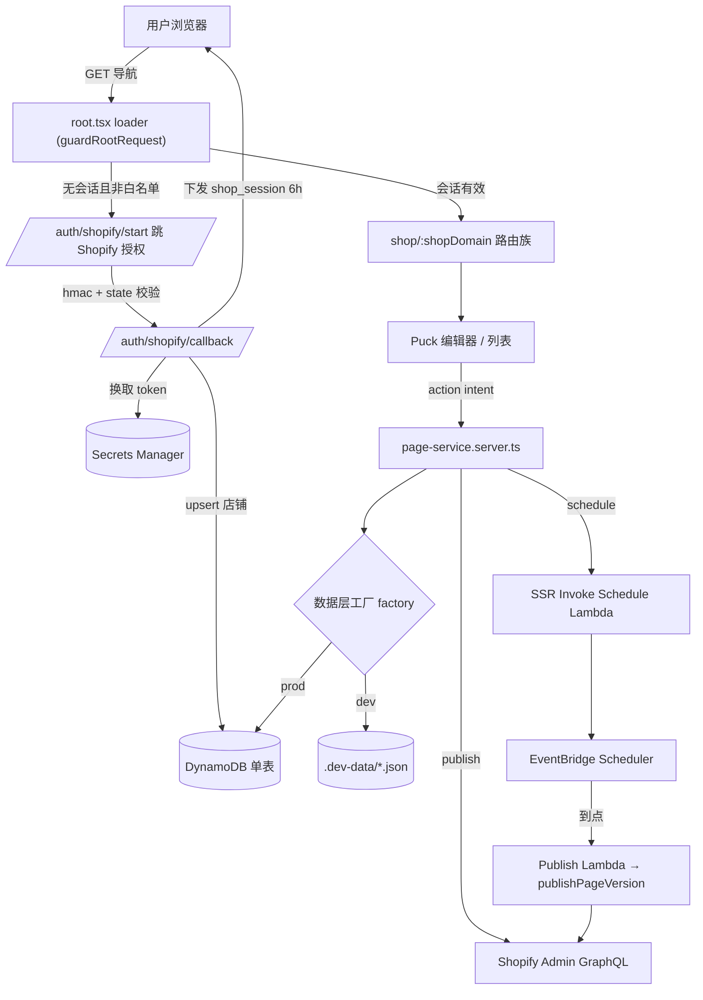

# 架构评审与部署方案

> 本文为一次性架构评审产出:梳理系统架构与数据库字段、给出优化建议、并汇总部署步骤。
> 权威的部署操作细节仍以 [`DEPLOYMENT.md`](DEPLOYMENT.md) 与 [`PRODUCTION_DEPLOY.md`](PRODUCTION_DEPLOY.md) 为准,本文不重复其分步命令。

## 1. 技术栈总览

| 层 | 技术 | 说明 |
|----|------|------|
| 前端/SSR | React Router v7 + Vite | 单页可视化编辑器,`@puckeditor/core` 0.21 提供拖拽编辑 |
| 托管 | AWS Amplify Hosting(SSR compute) | 产物目录 `.amplify-hosting`,由 `vite-plugin-react-router-amplify-hosting` 生成 |
| 数据 | DynamoDB 单表 | 店铺 / 页面 / 版本 / 定时任务 |
| 密钥 | Secrets Manager | 存 Shopify Access Token |
| 定时 | EventBridge Scheduler + 两个 Lambda | Publish Lambda(到点发布)、Schedule Lambda(SSR 代建/取消定时) |
| 资产 | S3 预签上传(可选) | `ASSETS_BUCKET_NAME` 配置后启用 |
| 集成 | Shopify Admin GraphQL | `pageCreate` / `pageUpdate`,固定 `templateSuffix: "visbuild"` |

## 2. 架构与数据流

关键因果:
- `isProductionRuntime()`(`NODE_ENV=production` 或 `USE_AWS_DATA_LAYER` 为真)是唯一可靠的"已部署"信号,同时决定 dev-login 是否 404、会话密钥是否强制、cookie 是否 `Secure`。
- 数据层由 [`factory.ts`](app/lib/server/factory.ts) 按 `useAwsDataLayer()` 懒加载单例化;AWS 分支动态 `import()`,使 dev 与 Lambda 冷启动更轻。
- 定时发布因 Amplify SSR 被拒绝 `iam:PassRole`,改为 SSR **Invoke** Schedule Lambda,由其在独立角色下创建 EventBridge 定时,到点触发 Publish Lambda。

## 3. DynamoDB 单表字段字典

主键为 `PK` / `SK`;`GSI1`(`GSI1PK` / `GSI1SK`)仅用于查询待执行任务(稀疏索引)。字段依据 [`ddb-keys.ts`](app/lib/server/aws/ddb-keys.ts) 与 [`types.ts`](app/lib/server/types.ts)。

| 实体 | PK | SK | 关键字段 |
|------|----|----|----------|
| shop | `SHOP#{id}` | `META` | id, domain, name, tokenSecretRef, createdAt, updatedAt |
| page_index | `SHOP#{shopId}` | `PAGE#{pageId}` | pageId, shopId, handle, title, status, shopifyPageGid, lastPublishedAt, pendingJobId, pagePath, updatedAt, scheduledPublishAt |
| page_lookup | `PAGE_LOOKUP#{pageId}` | `META` | shopId, pageIndexSk(pageId → shopId 反查) |
| page_body | `PAGE#{pageId}` | `META` | pageId, currentVisbuildData, currentHtml |
| version | `PAGE#{pageId}` | `VERSION#{versionId}` | versionId, pageId, visbuildData, html, source, createdAt |
| job | `JOB#{jobId}` | `META` | jobId, pageId, shopId, payloadVersionId, runAt, timezone, status, attempts, maxAttempts, lastError, createdAt, updatedAt |

- `job` 为 `pending` 时额外写 `GSI1PK=JOB_STATUS#pending` / `GSI1SK=runAt`;转非 pending 时删除这两个键(从索引中移除)。
- 页面状态机:`draft` → `dirty`(列表显示 outdated) → `published` / `scheduled`,由 [`publish.ts`](app/lib/server/publish.ts) 与 [`page-service.server.ts`](app/lib/server/page-service.server.ts) 驱动。

## 4. 优化建议(建议清单,未在本次落地)

> 以下为可选优化;为避免影响线上数据面与运行逻辑,本次仅修复类型告警与构建门禁,未改动 `infra/` 与数据层运行时。

| 优先级 | 项 | 现状 | 建议 |
|--------|----|------|------|
| 高 | 全表 Scan | `listShops`、`getPageVersion` 使用 `Scan`([repo.ddb.ts](app/lib/server/aws/repo.ddb.ts)) | `versionId` 已编码 `pageId`,可解析后 `GetItem`;店铺列表可加固定分区或 GSI 改 `Query` |
| 高 | 数据生命周期 | `version` 与已完成 `job` 无 TTL,会无限增长 | 增加 `ttl` 数字属性并开启 DynamoDB TTL,或仅保留最近 N 个版本 |
| 中 | 双写一致性 | `putPageIndex` 非事务地双写 index + lookup | 用 `TransactWriteItems`,或用 GSI(pageId 作 GSI PK)替代 lookup 表 |
| 中 | 备份 | `AppTable` 未开启 PITR | 打开 `PointInTimeRecoverySpecification` |
| 中 | 重试与最小提前量冲突 | 失败重试 backoff 可能 <60s,而 `createScheduleAt` 要求 `minLeadMs=60_000`([scheduler-core.ts](app/lib/server/aws/scheduler-core.ts)) | 早期重试改用直接重调 / SQS,或将小于 60s 的重试收敛到 60s |
| 中 | 观测 | 仅 Publish Lambda 有 CloudWatch 告警 | 为 Schedule Lambda 也加 Errors 告警;Publish Lambda 配 DLQ |
| 低 | SDK 版本 | `@aws-sdk/client-lambda` 为 `^3.1057.0`,其余为 `^3.758.0` | 对齐 AWS SDK 版本 |

## 5. 本次已落地(仅优化,无逻辑变更)

- **类型告警清零**:修复 `@puckeditor/core` 0.21 迁移带来的约 20 处 TS 错误 —— 全部为类型注解 / `as` 断言 / import 调整,运行时行为零变更。
  - 源头修复 [`createPuckColorField`](app/components/ui/puck-color-field.tsx) 返回类型(`CustomField<string>`),一次性消除 Accordion / Divider / Tabs 多处报错。
  - View 层 slot 类型改为运行时真实的 `SlotComponent`(Accordion / Tabs)。
  - Container / CustomHtml / Icon 的 `fields` / `resolveFields` 用精确类型断言收敛。
  - 服务端 `pages.server.ts`(root props `pagePath`)、`splat.server.ts`(判别联合 `runAt`)类型断言。
- **构建门禁**:[`amplify.yml`](amplify.yml) 在 `npm run build` 前加入 `npm run typecheck`(`react-router build` 本身不做类型检查);[`package.json`](package.json) 新增 `verify` 组合脚本(typecheck + lambda 包校验)。

## 6. 部署步骤概览

完整分步见 [`PRODUCTION_DEPLOY.md`](PRODUCTION_DEPLOY.md);要点:

1. **数据面**:`npm run deploy:data-plane`(CloudFormation 建表、两个 Lambda 骨架、IAM 角色、告警)。
2. **Publish / Schedule Lambda**:`npm run deploy:publish-lambda` / `deploy:schedule-lambda`(CJS 包,脚本内含 `verify:lambda-bundle`)。
3. **Amplify 环境变量**:`USE_AWS_DATA_LAYER=true`、`APP_TABLE_NAME`、`PUBLISH_LAMBDA_ARN`、`SCHEDULE_LAMBDA_ARN`、`SCHEDULER_ROLE_ARN`、`SHOPIFY_*`、`SCOPES`、`APP_AWS_REGION` 等,Save 后 Redeploy。
4. **SSR 执行角色 IAM**:挂 [`infra/amplify-ssr-iam-policy.json`](infra/amplify-ssr-iam-policy.json)(DDB / Secrets / `lambda:Invoke` Schedule Lambda),勿给 compute 角色 `PassRole`。
5. **Shopify 主题模板**:上线前在主题创建 `templates/page.visbuild.json`。

**上线前门禁(新增)**:本地或 CI 先执行 `npm run verify`(typecheck + lambda 包校验),Amplify 构建阶段已内置 `npm run typecheck`,类型错误会拦截部署。
