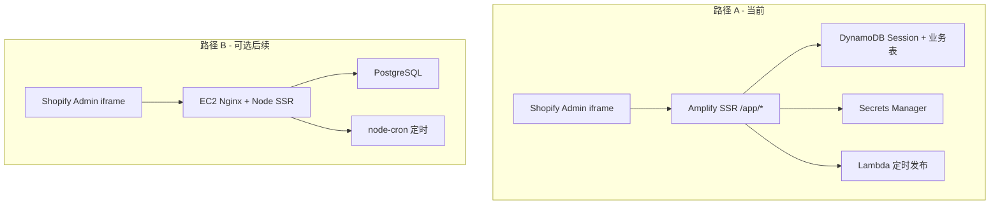

# Shopify 嵌入式 App（路径 A）

本文档描述**当前采用的路径 A**（在现有 Amplify + AWS 数据面上做嵌入式 Public App）。若需了解为何选 A、与 EC2 全量重构等方案的差异，见下文 [方案对比](#方案对比)。

---

## 方案对比

> **核心结论**：若目标只是「在 Shopify Admin 内嵌使用、去掉独立登录」，**不必 EC2 全量重构**；内嵌 App 需要的是 OAuth / Session / App Bridge，与是否用 Amplify 托管无关。

### 总览表

| 维度 | **路径 A（当前）** | **路径 B：EC2 全量重构** | **master 遗留：`/admin/*`** | **方案 C（脚本验链路）** |
|------|-------------------|-------------------------|----------------------------|-------------------------|
| **目标** | 嵌入式 Public App，店铺安装即用 | 彻底脱离 Amplify/AWS 托管，全部自建 | 独立管理后台 + 手动填 Token | 不经过后台 UI，验证 DDB→Lambda→Shopify |
| **Git 分支** | `feature/shopify-embedded-app` | 计划分支如 `feature/shopify-app-ec2`（未实施） | `master` | 无专用分支，本地脚本 |
| **Web 托管** | AWS Amplify Hosting SSR | EC2 + Nginx + PM2 | Amplify SSR | 不涉及 UI |
| **商家入口** | Admin → Apps → 本 App → `/app/pages` | 同左 | 浏览器打开 `/admin/login` | 无 |
| **鉴权** | Shopify OAuth + Session（DynamoDB） | OAuth + Session（PostgreSQL） | `ADMIN_API_KEY` 或开放 admin | `SHOPIFY_ACCESS_TOKEN` 环境变量 |
| **Token 存储** | Secrets Manager（按 shopId） | PG 加密字段等 | 表单写入 Secrets / DDB | `.env` 中 `shpat_` |
| **数据面** | DynamoDB + Lambda 定时发布 + S3 | PostgreSQL + node-cron + 本地/S3 文件 | 同路径 A 可共用栈 | 仅写 DDB + 调 Lambda |
| **典型工作量** | 约 1–2 周（已基本完成代码） | 约 3–4 周 | 已实现，不再作为主路径 | 数小时（运维/联调） |
| **App Store** | 可上架（需补合规 webhook） | 可上架 | 不适合（非标准安装流） | 不适用 |
| **适合场景** | 保留现有 AWS 投入、快速内嵌 | 明确不要 DynamoDB/Lambda/Amplify | 内部运维、临时调试 | CI/本地验证发布链路 |

### 路径 A vs 路径 B（架构）



### 内嵌 Shopify 真正要改什么（与托管无关）

| 必须项 | 路径 A 做法 | 路径 B 做法 |
|--------|-------------|-------------|
| OAuth `/auth`、`/auth/callback` | `@shopify/shopify-app-react-router` | `@shopify/shopify-api` + Express |
| Session 存储 | `DynamoDbSessionStorage` | PostgreSQL 等 |
| 嵌入式 UI | `AppProvider` + `NavMenu` + `/app/*` | 同左 |
| 去掉独立登录 | 删除 `/admin/login`、`ADMIN_API_KEY` | 同左 |
| Webhook | `APP_UNINSTALLED` 等 | 同左 |

**不必因内嵌而替换：** Puck 编辑器、GraphQL 发布逻辑、EventBridge Scheduler、S3 上传（路径 A 全部保留）。

### 路由与入口对比

| 入口 | 路径 A（feature 分支） | master（改造前） |
|------|------------------------|------------------|
| 商家使用 | `/app` → `/app/pages` | — |
| OAuth | `/auth/*` | — |
| 管理后台 | （已移除） | `/admin/login` → `/admin/shops` → `/admin/pages/:id` |
| 公开建站页 | `/`、`/pages` 等（演示） | 同左 |

### 部署与域名

| 项 | 路径 A 建议 | 说明 |
|----|-------------|------|
| 预览分支 | `feature/shopify-embedded-app` 独立 Amplify 域名 | 不覆盖 `master` |
| 验收通过后 | 合并 `master`，Partners App URL 改 master 域名 | 生产入口切换 |
| `SHOPIFY_APP_URL` | **仅 origin**（无 `/app`） | Partners 里 App URL 才带 `/app` |
| 数据面部署 | 仍见 [PRODUCTION_DEPLOY.md](./PRODUCTION_DEPLOY.md) | 与路径 A 共用 |

### 方案 C（补充）

见 [PRODUCTION_DEPLOY.md](./PRODUCTION_DEPLOY.md)「方案 C」：用 `npm run seed:publish-test` + `SHOPIFY_SHOP_DOMAIN` / `SHOPIFY_ACCESS_TOKEN` 验证 **DynamoDB → Publish Lambda → Shopify**，不替代路径 A 的安装与嵌入式 UI。

### 决策记录（为何选路径 A）

1. 演示站与数据面已在 **Amplify + DynamoDB + Lambda** 上跑通。  
2. 嵌入式 App 的增量主要是 **OAuth + App Bridge + 路由调整**，无需换数据库。  
3. **路径 B** 保留为可选后续（例如必须自建机房、合规要求不能依赖 Amplify 时）。  

---

## Partners 配置

| 项 | 值 |
|----|-----|
| App URL | `https://<amplify-domain>/app` |
| Redirect URL | `https://<amplify-domain>/auth/callback` |
| Embedded | 开启 |
| Scopes | `read_content`, `write_content` |

## Amplify 环境变量

```
SHOPIFY_API_KEY=
SHOPIFY_API_SECRET=
SCOPES=read_content,write_content
SHOPIFY_APP_URL=https://master.d3w458ytk16hpm.amplifyapp.com
```

保留现有 AWS 变量（`USE_AWS_DATA_LAYER`、`APP_TABLE_NAME` 等）。

## 本地开发

1. 复制 `.env.production.local.example` → `.env.production.local` 并填写 Shopify 凭据
2. 使用 [Cloudflare Tunnel](https://developers.cloudflare.com/cloudflare-one/connections/connect-networks/) 或 `shopify app dev` 暴露 HTTPS
3. Partners 中 App URL / Redirect URL 指向 tunnel 地址
4. `npm run dev` 或 `npm run start:local-prod`

## 安装测试

Partners → App → Select development store → Install app

安装后从 Shopify Admin → Apps 进入，路由为 `/app/pages`。

## 路由说明

| 路由 | 说明 |
|------|------|
| `/auth/*` | OAuth 安装/回调 |
| `/app/pages` | 页面列表（嵌入式） |
| `/app/pages/:pageId` | Puck 编辑器 |
| `/webhooks/app/uninstalled` | 卸载清理 |
| `/webhooks/app/scopes_update` | 店铺授权 scope 变更时更新 Session |

**页面同步**：Shopify 无稳定的 `pages/update` webhook 主题，请在 `/app/pages` 使用「从 Shopify 导入」或「全部导入」，勿再注册 `PAGES_UPDATE`。

旧版 `/admin/*` 路由已移除，请使用嵌入式 App 入口。

## API 版本

- `shopify.server.ts`：`ApiVersion.October25`（`2025-10`）
- `app/lib/server/shopify.ts`：GraphQL 客户端与上一致（见 `app/lib/shopify-api-version.ts`）

## 可选环境变量

| 变量 | 说明 |
|------|------|
| `SHOP_CUSTOM_DOMAIN` | 自定义店铺域名（与官方模板一致，用于 OAuth） |
